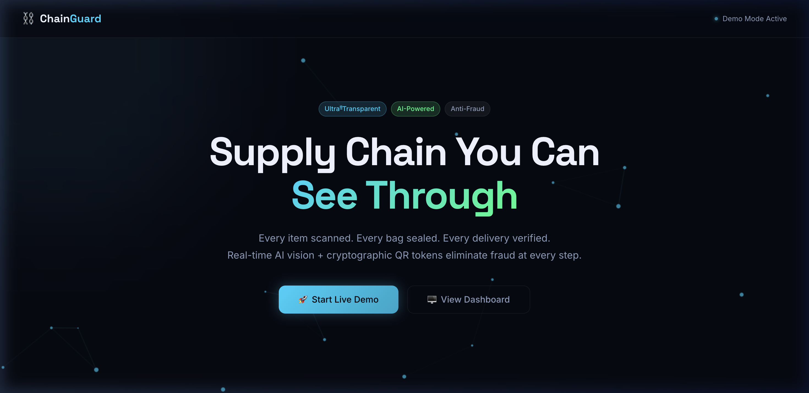
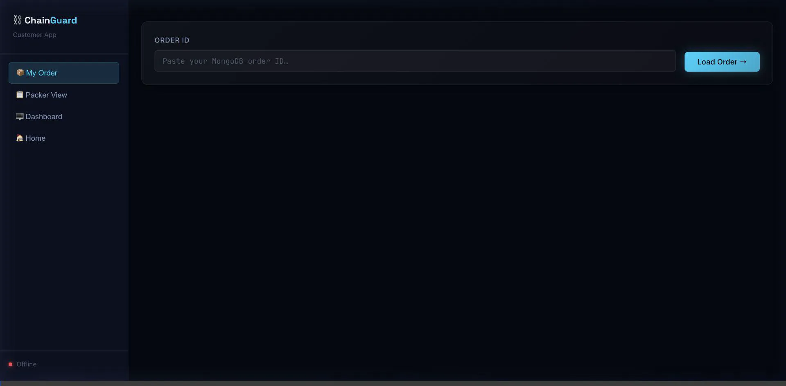
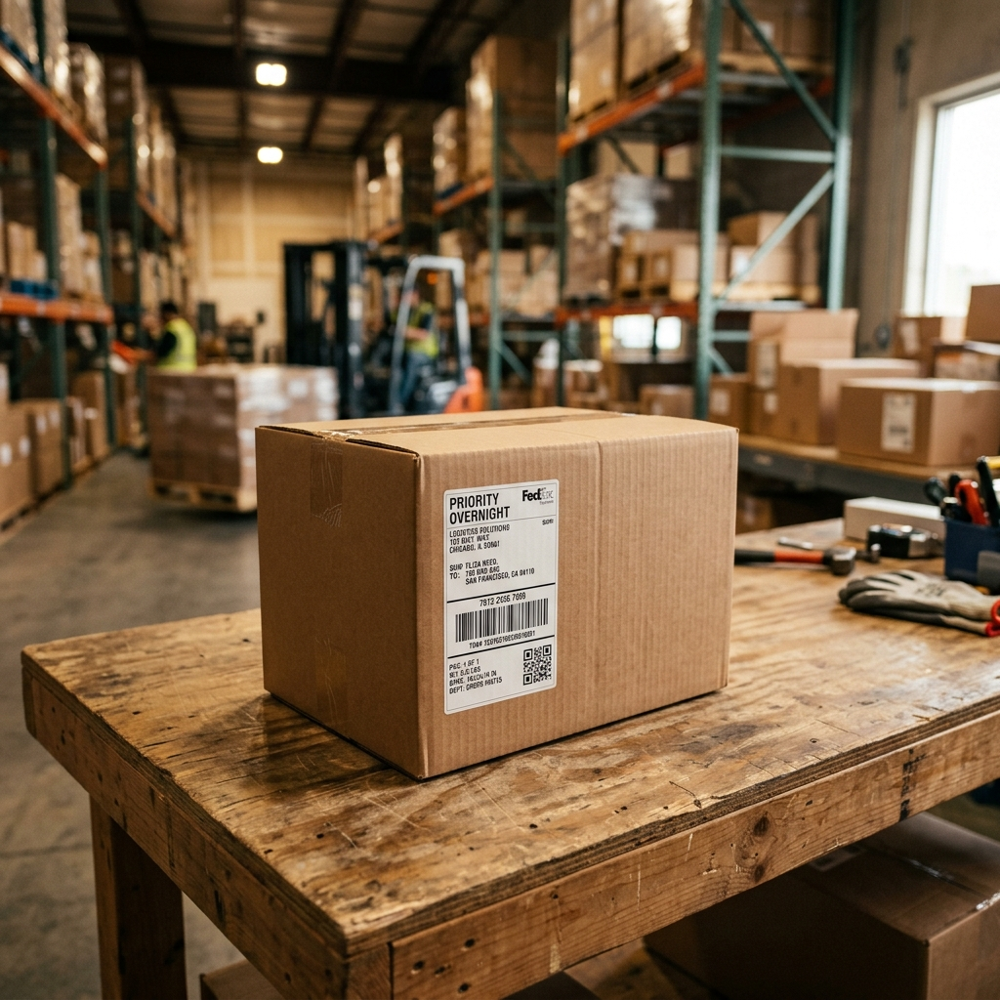
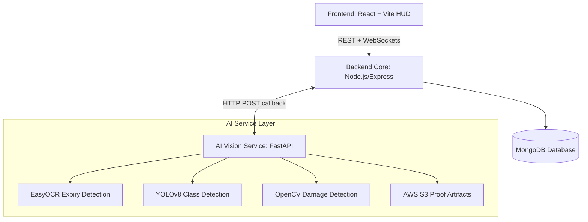

<div align="center">
  

  # 🛡️ ChainGuard Omni-Scanner

  **Ultra-Transparent Anti-Fraud Supply Chain System**

  [](https://reactjs.org/)
  [](https://nodejs.org/)
  [](https://python.org/)
  [](https://docker.com/)

  *Securing the last mile with real-time AI computer vision and cryptographic delivery tracking.*
</div>

---

## 📖 Overview

The **Anti-Fraud Supply Chain System** (ChainGuard) is an end-to-end framework designed to completely eliminate delivery tampering, refund fraud, and expired goods dispatch. By bridging high-performance AI vision models (YOLOv8 + EasyOCR) with a cryptographically secure real-time supply chain ledger, ChainGuard guarantees absolute transparency for both businesses and customers.

**Key Highlights:**
- **Zero-Trust Delivery:** Customers verify deliveries using a one-time cryptographic HMAC-SHA256 token.
- **AI Omni-Scanning:** Packer operations are fully automated—items are scanned for authenticity, intact packaging, and expiry dates before bagging.
- **Live WebSocket Tracking:** Customers watch their real-time parcel transit and view the exact photographic "proof" of their items being packed in the warehouse.
- **Demo Mode Ready:** Engineered with a complete mock AI bridge so developers can run the entire system on a single machine without requiring a massive GPU or AWS S3 buckets.

## 🎥 System Demonstration

To see the live action, check out our demonstration recording displaying the Customer App synced with the Warehouse Packer interfaces:



---

## ✨ Core Features Features

### 1. 🤖 AI-Powered Warehouse Fulfillment
The packing process is verified via our **Omni-Scanner** interface. Every item goes under the camera and receives an instant pass/fail validation.
<div style="display:flex; justify-content:center; gap: 20px;">
  
  
</div>

### 2. 🔐 High-Security Delivery Hand-off
Once packed, the physical bag is sealed. A cryptographically signed token is generated and attached to the route. Upon delivery, scanning the label triggers a `Verify Delivery` sequence. It is protected against **Replay Attacks** (you cannot use the same QR code twice).

### 3. 📊 Live Threat Dashboard
Warehouse managers get a live view of real-time item velocity, localized packer streams, and live fraud event logs via the internal Dashboard.

---

## 🏗️ Architecture

ChainGuard relies on a microservice architecture built for scale:



---

## 🚀 Quick Start (Docker)

ChainGuard is entirely containerized. With Docker Desktop installed, you can launch the ecosystem in one command!

**Prerequisites:** [Docker](https://www.docker.com/products/docker-desktop/)

1. **Clone the repository:**
   ```bash
   git clone https://github.com/yourusername/anti-fraud-supply-chain.git
   cd anti-fraud-supply-chain
   ```

2. **Launch the stack:**
   ```bash
   docker compose up --build -d
   ```
   *This single command builds and starts the MongoDB database, Node backend, Python AI layer, and the React frontend. It also automatically seeds the database with product and order data.*

3. **Access the Views:**
   Open **[http://localhost:3000](http://localhost:3000)** in your browser!
   - `http://localhost:3000/` – Landing Page
   - `http://localhost:3000/customer` – Customer Live Tracking
   - `http://localhost:3000/packer` – Warehouse Fulfillment & Scanner
   - `http://localhost:3000/dashboard` – Analytics Dashboard

---

## 💻 Tech Stack

- **Frontend:** React 18, Vite, Framer Motion, Recharts, Socket.io-client, Vanilla CSS (Glassmorphism design language).
- **Backend Core:** Node.js, Express, Mongoose, Socket.io, crypto (HMAC verification).
- **AI Vision Service:** Python 3.11, FastAPI, Pillow, Numpy, Opencv-headless.
- **Infrastructure:** Docker, Docker Compose, Nginx (Reverse Proxy).

---

## 🤝 Contributing

Contributions, issues, and feature requests are welcome! 
If you would like to test the heavy YOLO models instead of `DEMO_MODE`, simply set `DEMO_MODE=false` in the AI Service's `.env` config and install the full `torch` libraries.

## 📝 License

This project is [MIT](LICENSE) licensed.
